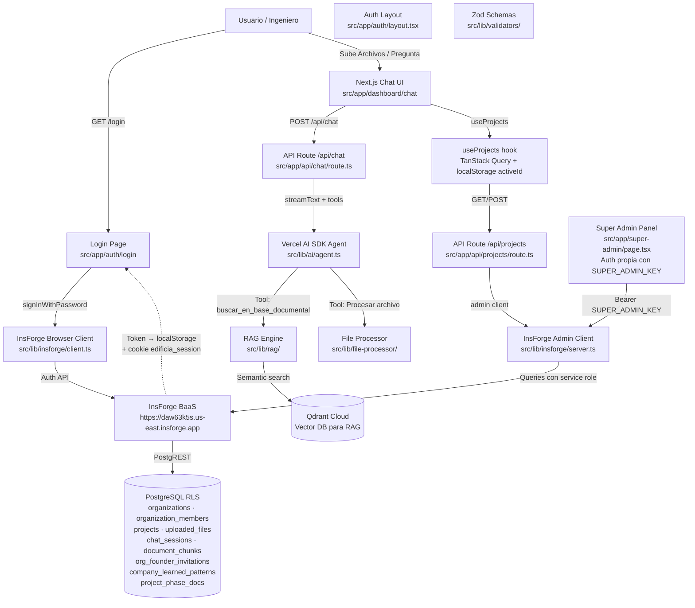

# Mapa de Arquitectura y Dependencias (Repo Map)

> **Última actualización**: 2026-05-13 (post-auditoría: 10 archivos muertos eliminados)

Este documento contiene el mapa estructural del proyecto. 
**Regla para la IA**: Cada vez que crees un módulo nuevo (Frontend, Backend, Database), DEBES actualizar este grafo. Antes de modificar código existente, lee este grafo para entender qué otras partes del sistema vas a afectar y evitar romper el código.

## ✅ Estado de Auth (arreglado)

> **Proxy real**: `src/proxy.ts` protege `/dashboard/*` y redirige a `/login` si no hay cookie `edificia_session`. Redirige también de `/login` → `/dashboard/chat` o `/register` → `/dashboard/chat` si ya hay sesión activa. También responde preflight CORS para `/api/*`.
>
> **Verificación JWT**: `verifyUserId()` en `src/lib/auth/jwt.ts` valida el token contra `${INSFORGE_URL}/auth/v1/user` server-side (cache 60 s). ⚠️ **Fallback peligroso**: si InsForge no responde, acepta el JWT sin verificar firma. Pendiente: agregar `AUTH_STRICT_MODE` para producción.
>
> **Función centralizada**: `requireAuth(req, opts?)` en `src/lib/auth/require-auth.ts` extrae token, verifica, resuelve org membership. Los 18 route handlers la usan.
>
> **Sesión persistente**: token en `localStorage` + cookie `edificia_session` (7 días). Sobrevive cierre de pestaña/navegador. Logout limpia ambos.
>
> **Rutas excluidas de auth**: `/api/health`, `/api/auth/register`, `/api/seed-demo`, `/api/super-admin/*` (auth propia con SUPER_ADMIN_KEY).



## Stack de Dependencias (2026-05-13)

| Paquete | Versión | Rol |
|---|---|---|
| next | ^16.2.4 | Framework Frontend + API Routes |
| react | ^19.0.0 | UI Runtime |
| typescript | ^5 | Tipado estricto E2E |
| tailwindcss | ^4 | Estilos utility-first |
| shadcn | ^4.6.0 | Componentes UI premium |
| @tanstack/react-query | ^5.74.4 | Data fetching / cache del cliente |
| zod | ^3.24.3 | Validación de schemas E2E |
| @insforge/sdk | ^1.2.5 | BaaS client — auth, database, storage |
| ai | ^6.0.168 | Vercel AI SDK — streaming + tools |
| @ai-sdk/openai | ^3.0.62 | Provider OpenAI-compatible (DeepSeek) |
| @ai-sdk/openai-compatible | ^2.0.46 | NVIDIA NIM embeddings |
| @ai-sdk/react | ^3.0.171 | React hooks (useChat) |
| @qdrant/js-client-rest | ^1.17.0 | Qdrant vector DB client |
| pino | ^10.3.1 | Logger estructurado |
| framer-motion | ^12.38.0 | Animaciones |
| lucide-react | ^1.12.0 | Iconos |
| next-themes | ^0.4.6 | Dark/Light mode |
| recharts | ^3.8.1 | Gráficos |
| resend | ^6.12.2 | Email transaccional |
| xlsx | ^0.18.5 | Excel parser |
| pdf-parse | ^2.4.5 | PDF parser |
| mammoth | ^1.12.0 | DOCX parser |
| dxf-parser | ^1.1.2 | DXF parser |
| dxf-viewer | ^1.0.47 | DXF WebGL viewer |
| docx | ^9.6.1 | DOCX generator |
| jspdf + jspdf-autotable | ^4.2.1 | PDF generator |
| react-markdown + remark-gfm | ^10.1.0 | Markdown rendering |

## Estructura de Carpetas (`src/`) — Actual

```
src/
├── app/
│   ├── (auth)/
│   │   ├── layout.tsx              → Layout centrado para auth
│   │   ├── login/page.tsx          → Formulario de login
│   │   └── register/page.tsx       → Formulario de registro (2 pasos: verificar email → completar)
│   ├── dashboard/
│   │   ├── layout.tsx              → Dashboard layout (sidebar + providers)
│   │   ├── chat/page.tsx           → Chat principal con el agente
│   │   ├── obras/[id]/page.tsx     → Detalle de obra
│   │   ├── documents/              → Base documental (pendiente)
│   │   └── admin/settings/         → Config admin empresa
│   ├── super-admin/
│   │   └── page.tsx                → Panel super admin (auth propia, NO middleware)
│   ├── api/
│   │   ├── auth/
│   │   │   ├── me/route.ts         → GET perfil usuario + org + branding
│   │   │   ├── register/route.ts   → POST registro + GET verificar email
│   │   │   ├── claim-founder/route.ts → POST crear org al login de fundador
│   │   │   ├── logout/route.ts     → POST logout
│   │   │   └── orgs/route.ts       → GET organizaciones del usuario
│   │   ├── chat/route.ts           → POST streaming chat (DeepSeek + tools)
│   │   ├── upload/route.ts         → POST subir archivo + RAG ingest
│   │   ├── projects/
│   │   │   ├── route.ts            → GET/POST proyectos
│   │   │   └── [id]/
│   │   │       ├── route.ts        → PATCH/DELETE proyecto
│   │   │       └── files/route.ts  → GET archivos del proyecto
│   │   ├── documents/
│   │   │   ├── route.ts            → GET/DELETE documentos
│   │   │   ├── save/route.ts       → POST guardar documento
│   │   │   └── [id]/route.ts       → GET documento por ID
│   │   ├── sessions/
│   │   │   ├── route.ts            → GET/POST/DELETE sesiones de chat
│   │   │   └── [id]/messages/route.ts → GET/POST mensajes de sesión
│   │   ├── generate/
│   │   │   ├── presupuesto/route.ts → POST generar presupuesto
│   │   │   ├── memoria/route.ts     → POST generar memoria técnica
│   │   │   └── informe/route.ts     → POST generar informe
│   │   ├── indices/
│   │   │   ├── route.ts            → GET índices de precios
│   │   │   └── upload/route.ts     → POST subir índice
│   │   ├── admin/
│   │   │   ├── settings/route.ts   → GET/PATCH config organización
│   │   │   ├── members/route.ts    → GET/POST/DELETE miembros
│   │   │   └── patterns/route.ts   → GET patrones aprendidos
│   │   ├── super-admin/
│   │   │   ├── founders/route.ts   → GET/POST/DELETE invitaciones fundador
│   │   │   ├── companies/route.ts  → GET/PATCH empresas
│   │   │   └── reset/route.ts      → POST reset completo
│   │   ├── health/route.ts         → GET health check (público)
│   │   └── seed-demo/route.ts      → POST seed datos demo
│   ├── layout.tsx                  → Root layout (fonts, providers)
│   ├── page.tsx                    → Redirect a /dashboard/chat
│   └── globals.css                 → Variables CSS + Tailwind v4
├── components/
│   ├── chat/
│   │   ├── ActiveProjectSection.tsx → Card de obra activa en sidebar
│   │   ├── AdminNavLink.tsx        → Link admin condicional (solo role=admin)
│   │   ├── AgentGreeting.tsx       → Saludo del agente
│   │   ├── ChatInput.tsx           → Input del chat + botón adjuntar
│   │   ├── DashboardSidebar.tsx    → Sidebar con historial de sesiones
│   │   ├── DropZone.tsx            → Drag & drop de archivos
│   │   ├── DxfViewerModal.tsx      → Visor WebGL de planos DXF
│   │   ├── FileCard.tsx            → Card de archivo subido con metadatos
│   │   ├── MessageBubble.tsx       → Burbuja de mensaje en el chat
│   │   ├── OrganizationCard.tsx    → Card de organización en sidebar
│   │   └── UserMenu.tsx            → Menú de usuario (logout)
│   ├── obras/
│   │   └── ProjectCard.tsx         → Card de proyecto en listado
│   ├── providers.tsx               → QueryClientProvider + ThemeProvider
│   └── ui/                         → Componentes Shadcn (auto-generados)
├── contexts/
│   ├── SessionContext.tsx          → Contexto de sesión de chat
│   └── ProjectContext.tsx          → Contexto de proyecto activo
├── hooks/
│   ├── useCurrentUser.ts           → Usuario autenticado (InsForge SDK)
│   ├── useOrgs.ts                  → Organizaciones del usuario
│   ├── useOrgMember.ts             → Membership + branding
│   ├── useProjects.ts              → CRUD de proyectos
│   ├── useProjectDetails.ts        → Detalle de obra activa
│   ├── useProjectCoverage.ts       → Cobertura documental de obra
│   ├── useProjectFiles.ts          → Archivos de un proyecto
│   ├── usePriceIndices.ts          → Índices de precios
│   ├── useSessionHistory.ts        → Historial de sesiones
│   └── useMessageHistory.ts        → Mensajes de una sesión
├── lib/
│   ├── auth/
│   │   ├── jwt.ts                  → Verificación JWT con InsForge + fallback decode-only
│   │   ├── require-auth.ts         → Guard centralizado para API routes (auth + org + role)
│   │   └── reset-token.ts          → HMAC-SHA256 tokens para password reset
│   ├── api/
│   │   ├── errors.ts               → Helpers de error estandarizados
│   │   └── rate-limit.ts           → Rate limiter in-memory
│   ├── insforge/
│   │   ├── client.ts               → Browser client (token en localStorage + cookie edificia_session)
│   │   └── server.ts               → Admin client (service role key)
│   ├── ai/
│   │   ├── agent.ts                → Config del agente + system prompt
│   │   ├── agent-tools.ts          → Tools sin org-binding
│   │   ├── agent-tools-bound.ts    → Tools con org-id servidor-verificado
│   │   └── session-learner.ts      → Aprendizaje de patrones post-sesión
│   ├── rag/
│   │   ├── ingest.ts               → Ingesta de documentos a Qdrant
│   │   └── search.ts               → Búsqueda semántica en Qdrant
│   ├── obra/
│   │   ├── phases.ts               → Detección de fase de obra
│   │   └── coverage.ts             → Cálculo de cobertura documental
│   ├── indices/
│   │   ├── query.ts                → Queries de índices de precios
│   │   └── compare.ts              → Comparación de índices
│   ├── excel/
│   │   └── parser.ts               → Parser de Excel (separado del file-processor)
│   ├── pattern-extractor/          → Extractor de patrones de archivos
│   ├── file-processor/             → Procesador multimodal de archivos
│   ├── file-cache.ts               → Cache de items de Excel
│   ├── logger.ts                   → Logger estructurado (Pino)
│   ├── validators/
│   │   ├── index.ts                → Schemas Zod compartidos (login, signUp, tenant)
│   │   └── blocks.ts               → Schemas Zod de los bloques de UI Generativa
│   └── utils.ts                    → Utilidades (cn, etc.)

db/
└── migrations/
    ├── 001_initial_schema.sql      → organizations + organization_members + RLS
    ├── 002_files_and_sessions.sql  → projects + uploaded_files + audit_sessions + chat_messages
    ├── 003_hardening.sql           → indexes + soft deletes + RLS fixes
    ├── 004_new_tables.sql          → organization_invitations + audit_results
    ├── 005_fix_rls_recursion.sql   → Fix recursión en políticas RLS
    ├── 006_agent_learning.sql      → company_learned_patterns
    ├── 007_document_chunks.sql     → document_chunks para RAG
    ├── 008_project_scoped_docs.sql → Docs scoped a proyecto
    ├── 009_project_phase_docs.sql  → Fases de obra + cobertura
    ├── 010_price_indices.sql       → Índices de precios
    ├── 011_chat_sessions.sql       → Sesiones de chat persistidas
    ├── 012_founder_invitations.sql → Invitaciones de fundador
    ├── 013_member_email.sql        → Email en organization_members
    └── 014_project_metadata.sql    → Metadatos extendidos de proyecto

migrations/ (InsForge CLI)
    ├── 20260507195853_catchup-missing-columns.sql
    ├── 20260513215703_project-metadata.sql
    └── 20260513220428_security-fixes.sql
```

## Registro de Cambios Estructurales

| Fecha | Sprint | Cambio |
|---|---|---|
| 2026-04-28 | Sprint 0 | Scaffold inicial: Next.js 16 + TS strict + Shadcn + Vercel AI SDK v6 + TanStack Query + Zod |
| 2026-04-29 | Sprint 1 | Auth flow: InsForge client (browser + admin), login form, schema PostgreSQL con RLS multi-tenant |
| 2026-04-29 | Sprint 1.5 | DB hardening: 14 indexes, soft deletes, RLS fixes, organization_invitations + audit_results |
| 2026-04-29 | Sprint 2 | Chat UI + Motor Matemático: AI agent con tools, API route streamText, dashboard layout + chat page |
| 2026-04-29 | Sprint 3 | Excel Upload + Parser: xlsx parser, /api/upload con InsForge storage, DropZone drag-and-drop |
| 2026-04-29 | Sprint 3.5 | Universal File Processor: PDF, DXF, DOCX, Imágenes (Claude multimodal), DWG (rechazado con guía) |
| 2026-04-29 | Rebrand | "Gemini Construcción" → "EdificIA". SYSTEM_PROMPT optimizado. v0.4.0 |
| 2026-04-29 | Sprint 4 | QoL: Dark/Light mode, Session History sidebar, auto-registro de sesión |
| 2026-04-29 | Sprint 7 | Persistencia de conversaciones: useMessageHistory, SessionContext, auto-save |
| 2026-04-29 | Sprint 9 | Visor DXF WebGL: dxf-viewer + Three.js, DxfViewerModal |
| 2026-05-01 | Sprint 17 | Proyecto activo: useProjects migrado a TanStack Query + API, contexto de proyecto en prompt |
| 2026-05-13 | Profesionalización | Purga de Ruflo, logger Pino, rate limiter, error helpers, validadores Zod, Super Admin panel completo, OrganizationCard, ActiveProjectSection, security fixes, migraciones 012-014 |
| 2026-05-13 | Fix | Removido `/super-admin` de rutas protegidas del proxy (bloqueaba acceso al panel) |
| 2026-05-13 | Limpieza | Auditoría de 133+ archivos: eliminados archivos muertos (OrgSwitcher.tsx, demo-data.ts, scripts debug, .mcp.json, .claude-flow/, zip raíz) |
| 2026-05-14 | Seguridad | Fix completo de auth: proxy/middleware real, requireAuth() centralizado, verifyUserId vía InsForge, localStorage+cookie, logout limpio. 18 routes refactorizadas. |
| 2026-05-16 | Corrección docs | `src/proxy.ts` confirmado como guard activo de dashboard + CORS. Referencias obsoletas a `src/middleware.ts` corregidas. |
| 2026-05-14 | Auditoría | Verificación de planes contra código. Corregidos CLAUDE.md, README (DeepSeek no Claude), PLAN_DE_MEJORA, TAREAS_CLAUDE, PLAN_FLUJO_EMPRESAS. Branding unificado a EdificIA. |
