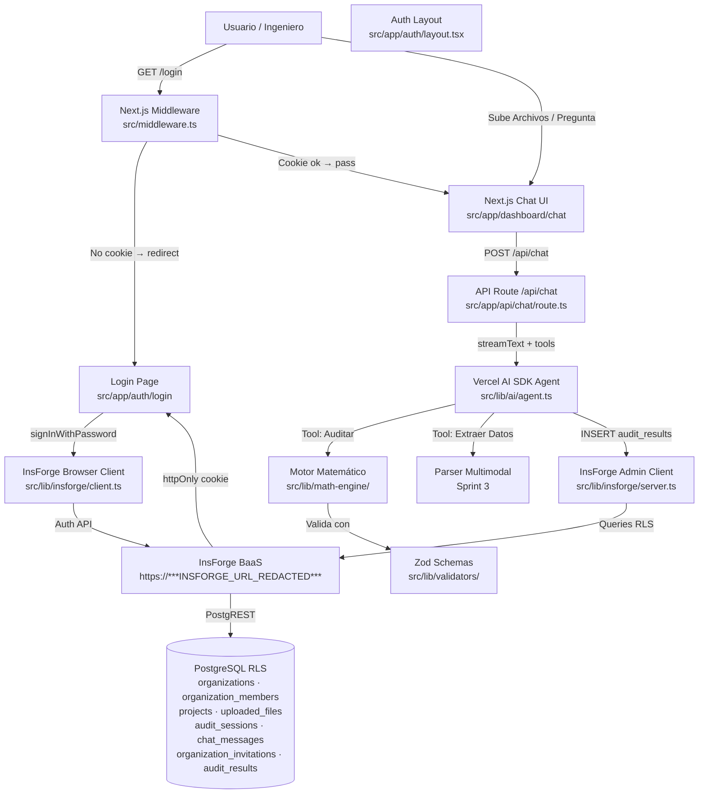

# Mapa de Arquitectura y Dependencias (Repo Map)

Este documento contiene el mapa estructural del proyecto. 
**Regla para la IA**: Cada vez que crees un módulo nuevo (Frontend, Backend, Database), DEBES actualizar este grafo. Antes de modificar código existente, lee este grafo para entender qué otras partes del sistema vas a afectar y evitar romper el código.



## Stack de Dependencias (2026-04-29)

| Paquete | Versión | Rol |
|---|---|---|
| next | ^16.2.4 | Framework Frontend + API Routes |
| react | ^19.0.0 | UI Runtime |
| typescript | ^5 | Tipado estricto E2E |
| tailwindcss | ^4 | Estilos utility-first |
| shadcn/ui | ^4.6.0 | Componentes UI premium |
| @tanstack/react-query | ^5.74.4 | Data fetching / cache del cliente |
| zod | ^3.24.3 | Validación de schemas E2E |
| @insforge/sdk | ^1.2.5 | BaaS client — auth, database, storage |
| ai | ^6 | Vercel AI SDK — streaming + tools |
| @ai-sdk/anthropic | ^3 | Provider Claude para el SDK |

## Estructura de Carpetas (`src/`)

```
src/
├── app/
│   ├── (auth)/
│   │   ├── layout.tsx            → Layout centrado para auth
│   │   └── login/page.tsx        → Formulario de login (Client Component)
│   ├── (dashboard)/chat/         → Chat principal con el agente (Sprint 2)
│   ├── api/chat/route.ts         → Route handler streaming (Sprint 2)
│   ├── layout.tsx                → Root layout (Geist font, QueryClientProvider)
│   └── globals.css               → Variables Shadcn + Tailwind v4
├── components/
│   ├── providers.tsx             → QueryClientProvider wrapper
│   └── ui/                       → Componentes Shadcn (auto-generados)
├── lib/
│   ├── insforge/
│   │   ├── client.ts             → Browser client singleton
│   │   └── server.ts             → Admin client (service role key)
│   ├── ai/agent.ts               → Config del agente (Sprint 2)
│   ├── math-engine/              → Motor de auditoría (Sprint 2)
│   └── validators/               → Schemas Zod compartidos E2E
├── middleware.ts                 → Protección de rutas via cookie
└── types/index.ts                → Tipos branded del dominio

db/
└── migrations/
    ├── 001_initial_schema.sql      → organizations + organization_members + RLS
    ├── 002_files_and_sessions.sql  → projects + uploaded_files + audit_sessions + chat_messages + RLS
    ├── 003_hardening.sql           → indexes + soft deletes + columnas faltantes + RLS fixes
    └── 004_new_tables.sql          → organization_invitations + audit_results + RLS
```

## Registro de Cambios Estructurales

| Fecha | Sprint | Cambio |
|---|---|---|
| 2026-04-28 | Sprint 0 | Scaffold inicial: Next.js 16 + TS strict + Shadcn + Vercel AI SDK v6 + TanStack Query + Zod |
| 2026-04-29 | Sprint 1 | Auth flow completo: InsForge client (browser + admin), middleware de rutas, login form, schema PostgreSQL con RLS multi-tenant |
| 2026-04-29 | Sprint 1.5 | DB hardening: 14 indexes, soft deletes en 5 tablas, columnas faltantes, RLS fixes, 2 nuevas tablas (organization_invitations + audit_results), fix open redirect middleware, env-var validation |
