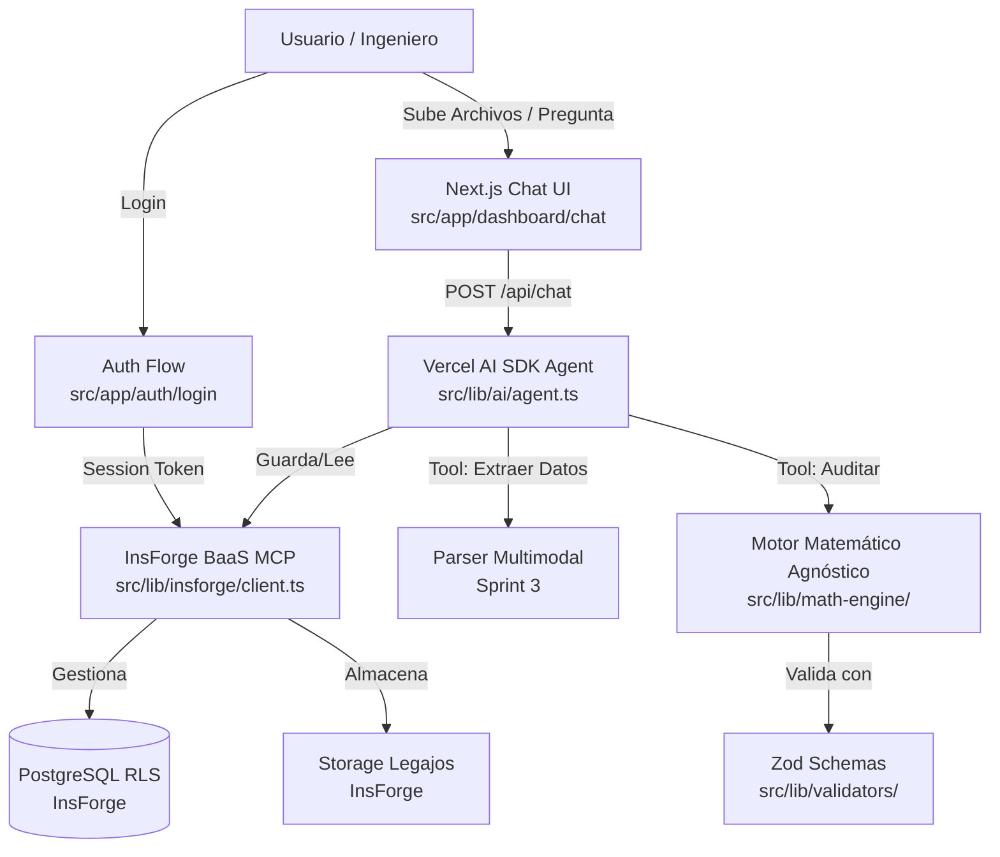

# Mapa de Arquitectura y Dependencias (Repo Map)

Este documento contiene el mapa estructural del proyecto. 
**Regla para la IA**: Cada vez que crees un módulo nuevo (Frontend, Backend, Database), DEBES actualizar este grafo. Antes de modificar código existente, lee este grafo para entender qué otras partes del sistema vas a afectar y evitar romper el código.



## Stack de Dependencias (2026-04-28)

| Paquete | Versión | Rol |
|---|---|---|
| next | ^16.2.4 | Framework Frontend + API Routes |
| react | ^19.0.0 | UI Runtime |
| typescript | ^5 | Tipado estricto E2E |
| tailwindcss | ^4 | Estilos utility-first |
| shadcn/ui | ^4.6.0 | Componentes UI premium |
| @tanstack/react-query | ^5.74.4 | Data fetching / cache del cliente |
| zod | ^3.24.3 | Validación de schemas E2E |
| ai | latest (v6) | Vercel AI SDK — streaming + tools |
| @ai-sdk/anthropic | latest | Provider Claude para el SDK |

## Estructura de Carpetas (`src/`)

```
src/
├── app/
│   ├── (auth)/login/         → Flujo de autenticación InsForge
│   ├── (dashboard)/chat/     → Chat principal con el agente
│   ├── api/chat/             → Route handler streaming del agente
│   ├── layout.tsx            → Root layout (Geist font, dark mode)
│   └── globals.css           → Variables Shadcn + Tailwind v4
├── components/
│   └── ui/                   → Componentes Shadcn (auto-generados)
├── lib/
│   ├── insforge/client.ts    → Cliente BaaS centralizado
│   ├── ai/agent.ts           → Config del agente (modelo, tools)
│   ├── math-engine/          → Motor de auditoría (Sprint 2)
│   └── validators/           → Schemas Zod compartidos E2E
└── types/index.ts            → Tipos branded del dominio
```

## Registro de Cambios Estructurales

| Fecha | Sprint | Cambio |
|---|---|---|
| 2026-04-28 | Sprint 0 | Scaffold inicial: Next.js 16 + TS strict + Shadcn + Vercel AI SDK v6 + TanStack Query + Zod |
