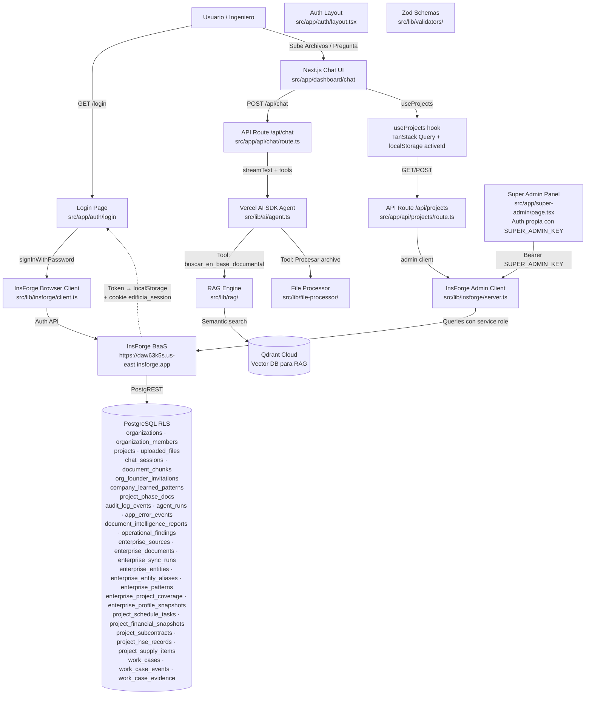

# Mapa de Arquitectura y Dependencias (Repo Map)

> **Última actualización**: 2026-05-20 (Indexación estructural enterprise + limpieza documental)

Este documento contiene el mapa estructural del proyecto. 
**Regla para la IA**: Cada vez que crees un módulo nuevo (Frontend, Backend, Database), DEBES actualizar este grafo. Antes de modificar código existente, lee este grafo para entender qué otras partes del sistema vas a afectar y evitar romper el código.

## ✅ Estado de Auth (arreglado)

> **Proxy real**: `src/proxy.ts` protege `/dashboard/*` y redirige a `/login` si no hay cookie `edificia_session`. Redirige también de `/login` → `/dashboard/chat` o `/register` → `/dashboard/chat` si ya hay sesión activa. También responde preflight CORS para `/api/*`.
>
> **Verificación JWT**: `verifyUserId()` en `src/lib/auth/jwt.ts` valida el token contra `${INSFORGE_URL}/auth/v1/user` server-side (cache 60 s). En producción es strict por defecto: si InsForge no verifica el token, se rechaza. `AUTH_STRICT_MODE=false` existe solo como break-glass operativo explícito para emergencias.
>
> **Función centralizada**: `requireAuth(req, opts?)` en `src/lib/auth/require-auth.ts` extrae token, verifica, resuelve org membership. Los 18 route handlers la usan.
>
> **Sesión persistente**: token en `localStorage` + cookie `edificia_session` (7 días). Sobrevive cierre de pestaña/navegador. Logout limpia ambos.
>
> **Rutas excluidas de auth**: `/api/health`, `/api/auth/register`, `/api/seed-demo`, `/api/super-admin/*` (auth propia con SUPER_ADMIN_KEY).



## Stack de Dependencias (2026-05-13)

| Paquete | Versión | Rol |
|---|---|---|
| next | ^16.2.4 | Framework Frontend + API Routes |
| react | ^19.0.0 | UI Runtime |
| typescript | ^5 | Tipado estricto E2E |
| tailwindcss | ^4 | Estilos utility-first |
| shadcn | ^4.6.0 | Componentes UI premium |
| @tanstack/react-query | ^5.74.4 | Data fetching / cache del cliente |
| zod | ^3.24.3 | Validación de schemas E2E |
| @insforge/sdk | ^1.2.5 | BaaS client — auth, database, storage |
| ai | ^6.0.168 | Vercel AI SDK — streaming + tools |
| @ai-sdk/openai | ^3.0.62 | Provider OpenAI estándar (no usado para DeepSeek desde 2026-05-18; queda disponible para futuros providers OpenAI nativos) |
| @ai-sdk/openai-compatible | ^2.0.46 | Provider DeepSeek — extrae y reinyecta `reasoning_content` que `@ai-sdk/openai` ignora |
| @ai-sdk/react | ^3.0.171 | React hooks (useChat) |
| @qdrant/js-client-rest | ^1.17.0 | Qdrant vector DB client |
| pino | ^10.3.1 | Logger estructurado |
| framer-motion | ^12.38.0 | Animaciones |
| lucide-react | ^1.12.0 | Iconos |
| recharts | ^3.8.1 | Gráficos |
| resend | ^6.12.2 | Email transaccional |
| xlsx | ^0.18.5 | Excel parser |
| pdf-parse | ^2.4.5 | PDF parser |
| mammoth | ^1.12.0 | DOCX parser |
| dxf-parser | ^1.1.2 | DXF parser |
| dxf-viewer | ^1.0.47 | DXF WebGL viewer |
| docx | ^9.6.1 | DOCX generator |
| jspdf + jspdf-autotable | ^4.2.1 | PDF generator |
| react-markdown + remark-gfm | ^10.1.0 | Markdown rendering |

## Estructura de Carpetas (`src/`) — Actual

```
src/
├── app/
│   ├── (auth)/
│   │   ├── layout.tsx              → Layout centrado para auth
│   │   ├── login/page.tsx          → Formulario de login
│   │   └── register/page.tsx       → Formulario de registro (2 pasos: verificar email → completar)
│   ├── dashboard/
│   │   ├── layout.tsx              → Dashboard layout (sidebar + providers)
│   │   ├── chat/page.tsx           → Chat principal con el agente
│   │   ├── expedientes/page.tsx    → Vista global de expedientes por estado/veredicto
│   │   ├── contexto/page.tsx       → Inteligencia Empresarial: Radar de Evidencia
│   │   ├── contexto/fuentes/page.tsx → Fuentes de Empresa dentro de Inteligencia Empresarial
│   │   ├── contexto/documentos/page.tsx → Redirect legacy a `/dashboard/contexto/fuentes`
│   │   ├── contexto/perfil/page.tsx → Perfil vivo de empresa
│   │   ├── obras/[id]/page.tsx     → Detalle de obra
│   │   ├── obras/[id]/expedientes/[workCaseId]/page.tsx → Trazabilidad de expediente
│   │   ├── obras/[id]/today/page.tsx → Día en la obra
│   │   ├── documents/page.tsx      → Redirect legacy a `/dashboard/contexto/fuentes`
│   │   ├── admin/errors/page.tsx   → Alertas de sistema capturadas por tenant
│   │   └── admin/settings/         → Config admin empresa
│   ├── super-admin/
│   │   └── page.tsx                → Panel super admin (auth propia, NO middleware)
│   ├── api/
│   │   ├── auth/
│   │   │   ├── me/route.ts         → GET perfil usuario + org + branding
│   │   │   ├── register/route.ts   → POST registro + GET verificar email
│   │   │   ├── claim-founder/route.ts → POST crear org al login de fundador
│   │   │   ├── logout/route.ts     → POST logout
│   │   │   └── orgs/route.ts       → GET organizaciones del usuario
│   │   ├── chat/route.ts           → POST streaming chat (DeepSeek + tools)
│   │   ├── enterprise-context/
│   │   │   └── search/route.ts     → GET lupa contextual multi-tenant
│   │   ├── work-cases/
│   │   │   ├── route.ts            → GET expedientes operativos por org/obra
│   │   │   └── [id]/route.ts       → GET detalle y PATCH estado de expediente con eventos/evidencias
│   │   ├── upload/route.ts         → POST subir archivo + RAG ingest
│   │   ├── cron/
│   │   │   └── project-proactivity/route.ts → CRON con secreto: scanner diario de riesgos de obra
│   │   ├── projects/
│   │   │   ├── route.ts            → GET/POST proyectos
│   │   │   └── [id]/
│   │   │       ├── route.ts        → PATCH/DELETE proyecto
│   │   │       ├── files/route.ts  → GET archivos del proyecto
│   │   │       └── daily-brief/route.ts → GET brief diario operativo de obra
│   │   ├── documents/
│   │   │   ├── route.ts            → GET/DELETE documentos
│   │   │   ├── save/route.ts       → POST guardar documento
│   │   │   ├── [id]/route.ts       → GET documento por ID
│   │   │   └── [id]/reindex/route.ts → POST reprocesar archivo persistido y reintentar RAG ingest
│   │   ├── sessions/
│   │   │   ├── route.ts            → GET/POST/DELETE sesiones de chat
│   │   │   └── [id]/messages/route.ts → GET/POST mensajes de sesión
│   │   ├── generate/
│   │   │   ├── presupuesto/route.ts → POST generar presupuesto
│   │   │   ├── memoria/route.ts     → POST generar memoria técnica
│   │   │   └── informe/route.ts     → POST generar informe
│   │   ├── indices/
│   │   │   ├── route.ts            → GET índices de precios
│   │   │   └── upload/route.ts     → POST subir índice
│   │   ├── admin/
│   │   │   ├── error-events/route.ts → GET/PATCH alertas locales (`app_error_events`)
│   │   │   ├── settings/route.ts   → GET/PATCH config organización
│   │   │   ├── members/route.ts    → GET/POST/DELETE miembros
│   │   │   └── patterns/route.ts   → GET patrones aprendidos
│   │   ├── super-admin/
│   │   │   ├── founders/route.ts   → GET/POST/DELETE invitaciones fundador
│   │   │   ├── companies/route.ts  → GET/PATCH empresas
│   │   │   ├── members/route.ts    → POST invitar miembro a una org
│   │   │   └── reset/route.ts      → POST reset con scope='all'|'organization' + confirmación tipada server-side
│   │   ├── knowledge-graph/route.ts → GET dump del knowledge graph (nodes uploaded_files + edges obra_relations) para consumo externo
│   │   ├── health/route.ts         → GET health check (público)
│   │   └── seed-demo/route.ts      → POST seed datos demo
│   ├── layout.tsx                  → Root layout (fonts, providers)
│   ├── page.tsx                    → Redirect a /dashboard/chat
│   └── globals.css                 → Variables CSS + Tailwind v4
├── components/
│   ├── chat/
│   │   ├── AgentGreeting.tsx       → Saludo del agente
│   │   ├── DxfViewerModal.tsx      → Visor WebGL de planos DXF
│   │   ├── MessageBubble.tsx       → Burbuja de mensaje en el chat
│   │   ├── ProactivityAlertsBanner.tsx → Banner de hallazgos proactivos
│   │   ├── input/                  → ChatInput + DropZone
│   │   ├── sidebar/                → Navegación, org, usuario, sesiones y obra activa
│   │   ├── cards/                  → Cards de archivos, planes, hipótesis, documentos y hallazgos
│   │   └── blocks/                 → Bloques visuales estructurados del agente
│   ├── obras/
│   │   └── ProjectCard.tsx         → Card de proyecto en listado
│   ├── theme/
│   │   └── ThemeInitScript.tsx     → Script crítico en <head> que setea data-theme antes del paint (anti-FOUC)
│   ├── super-admin/
│   │   └── ResetConfirmModal.tsx   → Modal genérico con confirmación tipada para acciones destructivas del super admin
│   ├── providers.tsx               → QueryClientProvider (sin ThemeProvider — el tema se maneja con vars CSS + data-theme)
│   └── ui/                         → Componentes Shadcn (auto-generados)
├── contexts/
│   ├── SessionContext.tsx          → Contexto de sesión de chat
│   └── ProjectContext.tsx          → Contexto de proyecto activo
├── hooks/
│   ├── useCurrentUser.ts           → Usuario autenticado (InsForge SDK)
│   ├── useOrgs.ts                  → Organizaciones del usuario
│   ├── useOrgMember.ts             → Membership + branding
│   ├── useProjects.ts              → CRUD de proyectos
│   ├── useProjectDetails.ts        → Detalle de obra activa
│   ├── useDailyProjectBrief.ts     → Brief diario de cronograma, HSE, acopios, finanzas, alertas y clima
│   ├── useProjectCoverage.ts       → Cobertura documental de obra
│   ├── useProjectFiles.ts          → Archivos de un proyecto
│   ├── usePriceIndices.ts          → Índices de precios
│   ├── useSessionHistory.ts        → Historial de sesiones (incluye `console.warn` estructurado en sync failures)
│   ├── useWorkCases.ts             → Expedientes operativos por obra
│   ├── useMessageHistory.ts        → Mensajes de una sesión (valida payload con `safeValidateUIMessages` del AI SDK)
│   └── useTheme.ts                 → Selector de tema: editorial | plano | oscuro (sin next-themes)
├── lib/
│   ├── auth/
│   │   ├── jwt.ts                  → Verificación JWT con InsForge; strict por defecto en producción
│   │   ├── require-auth.ts         → Guard centralizado para API routes (auth + org + role)
│   │   └── reset-token.ts          → HMAC-SHA256 tokens para password reset
│   ├── audit/
│   │   └── audit-log.ts            → Writer server-side de eventos append-only
│   ├── observability/
│   │   └── error-events.ts         → Captura best-effort de errores de app en `app_error_events`
│   ├── agent-core/
│   │   ├── types.ts                → Tipos base para scope, expediente operativo y capacidades
│   │   ├── context-builder.ts      → Builder puro del scope Empresa/Obra/Expediente
│   │   ├── capability-registry.ts  → Registro conceptual de capacidades del Agent Core
│   │   ├── prompt-modules.ts       → Composición modular futura del prompt
│   │   ├── runtime.ts              → Resolución runtime de scope, prompt efectivo, tools y capabilities
│   │   ├── agent-run-writer.ts     → Registro best-effort de ejecuciones del agente
│   │   ├── work-case-writer.ts     → Creación/asociación best-effort de expedientes desde sesiones
│   │   └── work-case-closer.ts     → Cierre agéntico de expedientes con veredicto, summary y evidencia
│   ├── api/
│   │   ├── errors.ts               → Helpers de error estandarizados
│   │   └── rate-limit.ts           → Rate limiter in-memory
│   ├── insforge/
│   │   ├── client.ts               → Browser client (token en localStorage + cookie edificia_session)
│   │   └── server.ts               → Admin client (service role key)
│   ├── ai/
│   │   ├── agent.ts                → Config del agente + system prompt
│   │   ├── agent-tools.ts          → Tools sin org-binding
│   │   ├── agent-tools-bound.ts    → Tools con org-id servidor-verificado
│   │   ├── active-memory.ts        → Escritura de memoria activa confirmada por usuario
│   │   ├── model-router.ts         → Selección fast/deep por señales del turno
│   │   ├── output/                 → Parsers de salida del agente (ej. hipótesis)
│   │   ├── observability/          → Telemetría de tools y runtime
│   │   └── session-learner.ts      → Aprendizaje de patrones post-sesión
│   ├── rag/
│   │   ├── ingest.ts               → Ingesta de documentos a Qdrant
│   │   └── search.ts               → Búsqueda semántica en Qdrant
│   ├── obra/
│   │   ├── phases.ts               → Detección de fase de obra
│   │   └── coverage.ts             → Cálculo de cobertura documental
│   ├── indices/
│   │   ├── query.ts                → Queries de índices de precios
│   │   └── compare.ts              → Comparación de índices
│   ├── weather/
│   │   └── open-meteo.ts           → Forecast Open-Meteo + impacto operativo de clima
│   ├── document-intelligence/
│   │   ├── context-scan.ts         → Detección heurística de contradicciones al subir
│   │   ├── report-writer.ts        → Persistencia best-effort de reportes documentales
│   │   └── report-linker.ts        → Vinculación de reportes a evidencia de expediente
│   ├── proactivity/
│   │   └── daily-scan.ts           → Scanner diario de riesgos sobre obras activas
│   ├── project-operations/
│   │   ├── agent-writers/          → Writers invocados por tools del agente
│   │   ├── brief/                  → Agregadores operativos diarios
│   │   ├── communications/         → Emails y comunicaciones a stakeholders
│   │   ├── contracts/              → Registro y auditoría de subcontratos
│   │   ├── supplies/               → Helpers de acopios y suministros
│   │   ├── financial-curve.ts      → Auditoría de curva S
│   │   ├── personnel.ts            → Verificación HSE de cuadrillas/personas
│   │   └── schedule.ts             → Reprogramación auditada de tareas
│   ├── excel/
│   │   └── parser.ts               → Parser de Excel (separado del file-processor)
│   ├── pattern-extractor/          → Extractor de patrones de archivos
│   ├── file-processor/             → Procesador multimodal de archivos
│   ├── file-cache.ts               → Cache de items de Excel
│   ├── logger.ts                   → Logger estructurado (Pino)
│   ├── theme.ts                    → Definición de temas (constantes + applyTheme/persistTheme/readStoredTheme)
│   ├── validators/
│   │   ├── index.ts                → Schemas Zod compartidos (login, signUp, tenant)
│   │   ├── api-responses.ts        → Contratos Zod de responses API consumidas por frontend
│   │   └── blocks.ts               → Schemas Zod de los bloques de UI Generativa
│   └── utils.ts                    → Utilidades (cn, etc.)

tests/
    ├── agent/                      → Agent Core, router y observabilidad del agente
    ├── chat/                       → Parsers/render helpers del chat
    ├── documents/                  → Excel y generación documental
    ├── math/                       → Motor matemático
    ├── project-operations/         → Cronograma y writers operativos
    ├── register-ts-loader.mjs      → Loader TS para node:test
    └── ts-resolve-loader.mjs       → Resolución de aliases en tests

migrations/ (canónico, InsForge CLI)
    ├── 20260507195853_catchup-missing-columns.sql
    ├── 20260513215703_project-metadata.sql
    ├── 20260513220428_security-fixes.sql
    ├── 20260515032815_add-founder-columns.sql
    ├── 20260516140000_immutable-audit-log.sql
    ├── 20260516215250_project-operations-schema.sql
    ├── 20260516223000_obra-relations.sql
    ├── 20260517210141_work-cases.sql
    ├── 20260517210757_chat-session-work-case-link.sql
    ├── 20260518001800_operational-findings.sql
    ├── 20260518002617_legacy-work-cases.sql
    ├── 20260518004152_agent-runs.sql
    ├── 20260518104406_document-intelligence-reports.sql
    ├── 20260518190721_work-case-verdict-closure.sql
    ├── 20260518230000_uploaded-files-indexing-status.sql
    ├── 20260519032742_enterprise-context-slice.sql
    └── 20260519033600_app-error-events.sql

scripts/ (operaciones manuales / smoke tests)
    ├── install-git-hooks.mjs       → Configura core.hooksPath=.githooks para hooks versionados
    ├── migrate.js                  → Wrapper de migración legacy
    ├── verify-wal.sh               → Verificación de WAL/replication
    └── smoke-chat.mjs              → Smoke E2E del agente: 3 turnos multi-turn contra DeepSeek real,
                                      valida ciclo reasoning_content. Ejecutable con `npm run smoke:chat`.

docs/archive/db-migrations-legacy/
    └── 001..016_*.sql              → histórico raw SQL previo; read-only, no usar para cambios nuevos
```

## Esquema Operativo de Obra

La arquitectura extendida de obra vive en PostgreSQL/RLS y queda preparada para CRON/workers y tools del agente. Todas las tablas tienen `organization_id`, `project_id`, soft-delete, `metadata JSONB`, timestamps e índices por organización/obra.

| Tabla | Propósito |
|---|---|
| `project_schedule_tasks` | Cronograma real: tareas, fechas, progreso, bloqueo y predecesoras. |
| `project_financial_snapshots` | Curva S y avance económico: planificado, real, comprometido, facturado y pagado. |
| `project_subcontracts` | Directorio de subcontratos por obra: rubro, monto, estado, contacto y retenciones. |
| `project_hse_records` | HSE/legales: ART, EPP, capacitaciones, aptos médicos, incidentes y accesos. |
| `project_supply_items` | Acopios y suministros: cantidades requeridas/pedidas/recibidas, proveedor, costo y fecha requerida. |

RLS: miembros de la organización leen; `admin` y `engineer` insertan/actualizan; solo `admin` puede borrar. El rol interno `project_admin` conserva acceso total para operaciones de backend. `projects.status` queda normalizado a `en_obra`, `planificacion`, `finalizado`, `pausado`.

## Expedientes Operativos (Agent Core)

Esquema introducido por `migrations/20260517210141_work-cases.sql`. Implementa el modelo `Empresa -> Obra -> Expediente Operativo -> Eventos/Evidencias` descripto en `docs/08_agent_core_redesign.md`. El consumo inicial es audit-only: sin cambios de prompt ni UX.

| Tabla | Propósito |
|---|---|
| `work_cases` | Expediente operativo por obra/empresa. Campos: `kind`, `status`, `title`, `summary`, `verdict`, `owner_user_id`, `closed_by_user_id`, `closed_at`, `metadata`, soft-delete. `project_id` nullable (no toda obra todavía vincula, y expedientes empresariales pueden existir sin obra). |
| `work_case_events` | Bitácora append-only del expediente. `event_type` libre, `payload JSONB`. `project_id` nullable para reflejar el campo del expediente padre. Sin UPDATE permitido (solo admin puede DELETE). |
| `work_case_evidence` | Vínculos a evidencia (`file`, `chunk`, `relation`, `audit_event`, `tool_run`, `finding`, `message`, `schedule_task`, `hse_record`, `supply_item`, `financial_snapshot`, `subcontract`, `document_report`, `external`). `entity_type`/`entity_id` flexibles para apuntar a cualquier tabla operativa. |
| `agent_runs` | Ejecuciones del agente con `work_case_id`, `chat_session_id`, actor, modelo, tier, capacidades, usage, telemetría de tools, latencia y request id. Sirve como trazabilidad granular por turno sin usar `audit_log_events` como read model operativo. |

Constraints clave:

- `work_cases.kind` ∈ {`budget_audit`, `document_audit`, `schedule_review`, `financial_review`, `hse_review`, `supplies_review`, `subcontract_review`, `daily_brief`, `operations_update`, `communication`, `general`, `legacy_conversation`}.
- `work_cases.status` ∈ {`open`, `in_progress`, `waiting`, `resolved`, `closed`, `archived`}.
- `work_cases.verdict` ∈ {`approved`, `flagged`, `inconclusive`, `rejected`, `superseded`} ∪ `NULL`. Solo se escribe cuando el expediente entra a un estado terminal (`resolved`/`closed`/`archived`).
- `work_case_evidence.confidence` opcional, en rango `[0,1]`.

RLS por `organization_id` con el patrón habitual: miembros leen; `admin`/`engineer` insertan/actualizan `work_cases`; eventos y evidencia son append-only para `engineer` (solo `admin` borra); `agent_runs` permite insert de `admin`/`engineer` y lectura por miembros; rol interno `project_admin` mantiene acceso total para backend.

### Asociación inicial chat_sessions → work_cases

`migrations/20260517210757_chat-session-work-case-link.sql` agrega `chat_sessions.work_case_id UUID NULL` con FK a `work_cases(id)` ON DELETE SET NULL e índices parciales por org/work_case. La columna es nullable para mantener legacy intacto.

Cuando un cliente llama `POST /api/sessions` con un `projectId` válido y la sesión es nueva, el server:

1. Verifica con admin client si ya existe `chat_sessions.work_case_id` para ese `id` (idempotente).
2. Si no existe, llama `ensureWorkCaseForChatSession()` (en `src/lib/agent-core/work-case-writer.ts`), que inserta un `work_case` con `kind` inferido del `fileType` (`excel → budget_audit`, `pdf/docx/dxf/image → document_audit`, default `general`), `status='open'`, `owner_user_id=auth.userId`, `metadata.chatSessionId`, y un evento `work_case_events` de tipo `chat_session.linked`.
3. Hace upsert de `chat_sessions` con el `work_case_id` resuelto.

Sesiones sin `projectId` siguen sin expediente. Las sesiones legacy preexistentes fueron migradas por `20260518002617_legacy-work-cases.sql`. No hay cambios de prompt en este bloque.

### Trazabilidad audit-only en /api/chat

`src/app/dashboard/chat/page.tsx` envía `x-chat-session-id` desde el `DefaultChatTransport`; `src/proxy.ts` lo permite en CORS. `src/app/api/chat/route.ts` usa ese header solo como puntero: busca `chat_sessions` filtrando por `organization_id = auth.orgId`, `user_id = auth.userId`, `id = x-chat-session-id` y `deleted_at IS NULL`, seleccionando `work_case_id, project_id`.

Si la sesión resuelta tiene `work_case_id`, el `AgentCoreScope` pasa a nivel `work_case` y `audit_log_events.payload.agentCore.scope.workCaseId` queda persistido. Si además la sesión trae `project_id` y no venía `x-project-id`, se usa ese `project_id` ya filtrado server-side para el scope y el audit log. Al finalizar cada turno, `/api/chat` inserta best-effort una fila en `agent_runs` con modelo, tier, capacidades, usage, telemetría de tools y latencia. Si hay expediente, también inserta `work_case_events.event_type = 'chat.turn_completed'` y vincula `agentRunId` en el payload. Fallas de estos inserts se loguean y no rompen el stream.

### UI y legacy de expedientes

`GET /api/work-cases` lista expedientes de la organización autenticada, con filtro opcional `projectId`. Si hay una `chat_session` del usuario actual vinculada al expediente, devuelve `chatSessionId` para abrir el chat correspondiente. La ruta valida `projectId` contra `organization_id = auth.orgId` antes de consultar.

`GET /api/work-cases/[id]` devuelve el expediente filtrado por `organization_id = auth.orgId` junto con `work_case_events`, `work_case_evidence` y los `document_intelligence_reports` vinculados (con `fileName` resuelto desde `uploaded_files`). También resuelve la sesión de chat asociada para el usuario actual, si existe. `PATCH /api/work-cases/[id]` permite a `admin`/`engineer` cambiar `status`/`summary`/`verdict`, ajusta `closed_at` y `closed_by_user_id` cuando entra a estado terminal, limpia `verdict` y actor de cierre al reabrir, y registra `work_case_events.work_case.status_changed` con `previousVerdict`, `verdict`, `summary` y `closedByUserId` en el payload. No expone expedientes de otros tenants ni confía en IDs de cliente para aislar organización.

La tool bound `proponer_cierre_expediente` permite al agente marcar el expediente activo como `resolved` cuando ya completó la auditoría y tiene evidencia suficiente. El `organization_id` y `actor_user_id` se inyectan server-side desde `createBoundTools()`, el `workCaseId` llega al prompt solo desde la sesión validada, y `closeWorkCaseFromAgent()` rechaza expedientes inexistentes, de otra organización o ya terminales. La operación escribe `verdict`, `summary`, `closed_at`, `closed_by_user_id`, un evento `work_case.status_changed` y evidencia opcional en `work_case_evidence`.

`src/hooks/useWorkCases.ts` consume esa API y `/dashboard/obras/[id]` muestra una banda de expedientes operativos arriba de documentos/cobertura. El botón "Abrir" cambia a la sesión asociada y activa la obra, manteniendo el historial de sesiones como compatibilidad. La vista `/dashboard/obras/[id]/expedientes/[workCaseId]` muestra métricas, replay de eventos con `payload` expandible, evidencia con `metadata` expandible, la sección "Reportes documentales" (con clasificación, extracción, riesgos y hallazgos expandibles por reporte) y un bloque "Resolución del expediente" que renderiza el `verdict` y `summary` actuales. Las acciones `Resolver` y `Cerrar` abren un modal con selector de veredicto (`approved`/`flagged`/`inconclusive`/`rejected`/`superseded`) y textarea de resumen editable antes del estado terminal. `Reabrir` limpia `verdict`, `summary`, `closed_at` y `closed_by_user_id`.

`migrations/20260518002617_legacy-work-cases.sql` migra sesiones históricas con `project_id` a expedientes `legacy_conversation`: crea `work_cases`, actualiza `chat_sessions.work_case_id`, registra `work_case_events.chat_session.legacy_linked`, agrega evidencia `message` para el snapshot y evidencia `file` cuando puede inferir archivos por `fileId` o nombre dentro del JSON de mensajes.

## Operational Findings

`migrations/20260518001800_operational-findings.sql` agrega `operational_findings` como read model vivo para alertas operativas. La tabla separa estado accionable de `audit_log_events`, que queda como evidencia inmutable append-only.

Campos principales: `organization_id`, `project_id`, `project_name`, `finding_key`, `type`, `severity`, `status`, `title`, `detail`, `entity_type`, `entity_id`, `due_date`, `metadata`, `first_detected_at`, `last_detected_at`, `resolved_at`, `scanned_at`.

Invariantes:

- `finding_key` es estable y única por `organization_id, project_id`.
- `status` ∈ {`open`, `resolved`, `dismissed`}.
- `type` cubre los hallazgos de proactividad vigentes (`schedule.*`, `hse.*`, `supply.*`, `financial.overrun`, `project.stale_docs`).
- RLS por `organization_id`: miembros leen; `admin`/`engineer` insertan/actualizan; solo `admin` borra; `project_admin` tiene acceso total interno.

Flujo actual:

1. `runDailyProjectScan()` detecta hallazgos por obra.
2. `replaceProjectOperationalFindings()` upsertea hallazgos actuales en `operational_findings` y marca como `resolved` los `open` que ya no aparecen en la corrida.
3. `writeAuditLogEvent("project.proactivity_scan")` conserva un resumen append-only con conteos y `findingKeys`, no el estado vivo primario.
4. `GET /api/proactivity/findings` y `buildDailyBrief()` leen `operational_findings` con `status = open`.

## Document Intelligence Reports

`migrations/20260518104406_document-intelligence-reports.sql` agrega `document_intelligence_reports` como read model documental por archivo. La tabla persiste clasificación, extracción estructurada, riesgos, hallazgos, veredicto y confianza, separando el estado consultable del audit log inmutable.

Campos principales: `organization_id`, `project_id`, `work_case_id`, `file_id`, `agent_run_id`, `report_type`, `status`, `source`, `document_type`, `classification`, `extraction`, `risks`, `findings`, `verdict`, `confidence`, `summary`, `metadata`.

Invariantes:

- `report_type` ∈ {`upload_scan`, `agent_audit`, `manual_review`}.
- `status` ∈ {`ready`, `needs_review`, `superseded`, `failed`}.
- `verdict` ∈ {`consistent`, `inconsistent`, `needs_review`, `unsupported`}.
- RLS por `organization_id`: miembros leen; `admin`/`engineer` insertan/actualizan; solo `admin` borra; `project_admin` tiene acceso total interno.

Flujo actual:

1. `/api/upload` procesa el archivo, corre PII scan y context scan.
2. `writeDocumentIntelligenceReport()` inserta un reporte `upload_scan` best-effort con clasificación heurística, señales extraídas, riesgos, hallazgos y veredicto inicial.
3. Si el upload ya puede resolver un `work_case_id`, se agrega `work_case_evidence.evidence_type = 'document_report'`.
4. Si el expediente se crea después desde `POST /api/sessions`, `linkLatestDocumentReportToWorkCase()` vincula el último reporte del archivo por `organization_id + project_id + file_name` al expediente recién creado.

## Perfil Empresarial Vivo

`migrations/20260519055500_enterprise-profile-slice.sql` agrega cinco tablas que materializan el "perfil empresarial vivo" descrito en `docs/06_enterprise_context_layer.md` §4 y Etapa 3, sin depender todavía de conectores externos:

- `enterprise_entities` — entidades detectadas (`supplier`, `subcontractor`, `trade`, `location`, `cost_center`, `document_type`, `currency`, `naming_convention`) con `canonical_name`, `display_name`, `occurrence_count`, `confidence`, `last_seen_at` y `metadata`. Unique parcial por `(organization_id, entity_type, canonical_name) WHERE deleted_at IS NULL`.
- `enterprise_entity_aliases` — variantes/aliases de cada entidad con `occurrence_count` y `last_seen_at`. Unique por `(entity_id, alias)`.
- `enterprise_patterns` — convenciones internas (`naming_convention`, `document_format`, `currency`, `trade_vocabulary`, `source_reliability`, `frequent_supplier`, `frequent_subcontractor`, `sensitivity_default`) con `pattern_key`, `pattern_value JSONB`, `confidence`, `evidence_count` y `last_observed_at`.
- `enterprise_project_coverage` — read model agregado por obra: conteos de documentos/indexados/observados, subcontratos, supplies, HSE, schedule, findings_open, reports, `coverage_score` 0-1 y `risk_level` (`bajo`/`medio`/`alto`/`critico`). Unique por `(organization_id, project_id)`.
- `enterprise_profile_snapshots` — historial recalculable. Cada rebuild incrementa `version`, persiste `entity_count`/`pattern_count`/`coverage_count`, `summary`, `payload JSONB` (top entidades/patrones/cobertura) y `trigger_source` (`manual`/`scheduled`/`upload`/`system`).

RLS: lectura para miembros, escritura para `admin`/`engineer`, acceso total para `project_admin`.

Pipeline del perfil:

1. `src/lib/enterprise-context/profile-aggregator.ts` es la lógica pura (testeable sin DB). `aggregateEnterpriseProfile(inputs)` extrae entidades por tipo, patrones (`detectNamingPrefixes`, `computeSourceReliability`), cobertura por obra (`computeCoverage` con score ponderado y `computeRiskLevel`) y resumen textual.
2. `src/lib/enterprise-context/profile-builder.ts` lee de `projects`, `project_subcontracts`, `project_supply_items`, `project_hse_records`, `project_schedule_tasks`, `project_financial_snapshots`, `enterprise_documents` (+ `enterprise_sources` para resolver `source_type`), `document_intelligence_reports` y `operational_findings`. Llama al aggregator, upsertea entidades/aliases/patterns/coverage, inserta snapshot nuevo y devuelve resumen.
3. `GET /api/enterprise-context/profile` devuelve el perfil consultable (entidades + patrones + cobertura por obra + meta del último snapshot). `POST /api/enterprise-context/profile/refresh` (requiere `engineer`+) dispara `rebuildEnterpriseProfile()` y devuelve la nueva versión.
4. `/dashboard/contexto/perfil` consume ambos endpoints y muestra resumen vivo, métricas, filtros por tipo de entidad, lista de patrones con confianza y evidencia, y tabla de cobertura por obra con score visual + nivel de riesgo + botón "Recalcular perfil". `/dashboard/contexto/layout.tsx` concentra las tabs "Radar", "Fuentes" y "Mapa Vivo" para que Base Documental no exista como bloque paralelo.

El perfil está integrado al agente: `src/lib/enterprise-context/profile-reader.ts` expone `loadEnterpriseProfileForAgent(orgId)` (compact para prompt) y `queryEnterpriseProfileFacet(...)` (drill-down por facet). `src/lib/agent-core/runtime.ts` lo carga junto con learnedPatterns/recentSessions en paralelo y lo pasa a `buildSystemPrompt()`, que renderiza una sección "Perfil de empresa (snapshot vN)" cuando hay snapshot disponible. La tool bound `consultar_perfil_empresa({ facet? })` deja al agente profundizar en `suppliers`/`subcontractors`/`trades`/`patterns`/`coverage`/`summary` sin bloatear el prompt; `organization_id` lo inyecta el binding server-side. Pendiente estratégico futuro: detección automática de obras vía conectores externos y `auth.users.profile` enriquecido por usuario (`/api/auth/me` ya lee `client.auth.getProfile(userId)` cuando el JWT no trae nombre).

## Memoria Activa Escribible

`migrations/20260519170241_active-agent-memory.sql` expande `company_learned_patterns.document_type` para aceptar `audit_history` y `agent_memory` además de tipos documentales (`excel`/`pdf`/`dxf`/`docx`). Esto corrige la restricción legacy que impedía persistir aprendizajes no-documentales.

`src/lib/ai/active-memory.ts` implementa `recordAgentLearning()`:

1. Normaliza una clave estable (`proveedores.hormigon.preferido`), deduplica evidencia y tags, y exige resumen + evidencia concreta.
2. Upsertea en `company_learned_patterns` con `document_type='agent_memory'` y `pattern_key=<key>`.
3. Preserva evidencia previa, incrementa `sample_count`, conserva la mayor confianza y registra `agent.memory_recorded` en `audit_log_events`.
4. La tool bound `recordar_aprendizaje` no recibe `organization_id`; `createBoundTools()` inyecta org/usuario y, cuando el runtime lo validó, `projectId`/`workCaseId`.

El prompt exige confirmación explícita del usuario antes de escribir memoria. Los aprendizajes guardados se vuelven a cargar como parte de `learnedPatterns` y aparecen en la sección "Patrones aprendidos de esta empresa".

## App Error Events

`migrations/20260519033600_app-error-events.sql` agrega `app_error_events` como sistema local de alertas de runtime sin dependencia externa. No reemplaza `audit_log_events`: registra fallas operativas y técnicas que un admin debe revisar.

Campos principales: `organization_id`, `project_id`, `actor_user_id`, `request_id`, `route`, `method`, `severity`, `fingerprint`, `message`, `stack`, `context`, `resolved_at`, `created_at`.

Flujo actual:

1. `captureAppError()` en `src/lib/observability/error-events.ts` serializa el error, calcula fingerprint y escribe best-effort con admin client.
2. Rutas críticas lo llaman en catches de `/api/chat`, `/api/cron/project-proactivity`, `/api/proactivity/findings`, `/api/enterprise-context/search`, `/api/documents/[id]/reindex` y fallas no fatales de `/api/upload`.
3. `GET /api/admin/error-events` lista eventos de la `organization_id` autenticada; `PATCH /api/admin/error-events` marca eventos como resueltos.
4. `/dashboard/admin/errors` permite a admins ver contexto, severidad, ruta, fingerprint y resolver alertas pendientes.

RLS: `admin` lee/actualiza dentro de su organización; `admin`/`engineer` pueden insertar cuando la inserción ocurre con usuario normal; `project_admin` conserva acceso total interno para backend. `/api/super-admin/reset` limpia esta tabla tanto en reset total como en reset por organización.

## Bloques Visuales del Agente

Los bloques de `src/components/chat/blocks/` están cableados como contrato de UI generativa:

1. El agente llama una tool de presentación (`proyectar_metricas`, `proyectar_legajo_grafico`, `proyectar_comparativa`, `proyectar_cronograma`, `proyectar_riesgos`, `proyectar_evidencia`).
2. La tool devuelve un objeto `kind` validable por `src/lib/validators/blocks.ts`.
3. `src/components/chat/MessageBubble.tsx` detecta la tool, valida con `BlockSpec.safeParse()` y renderiza `ResponseBlock`.
4. `/dashboard/blocks-demo` permite verificar los bloques en desarrollo sin depender de una conversación real.

El set productivo actual cubre: métricas, legajo gráfico, comparativas, cronograma, registro de riesgos operativos y ledger de evidencia. Los seis bloques comparten `BlockShell`, skeletons dedicados y responsive horizontal controlado para tablas/gantt sin romper mobile. `risk_register` y `evidence_ledger` usan primitives shadcn locales (`Badge`, `Table`, `Tabs`) y todo el set queda registrado en `docs/design/shadcn-blocks/manifest.json` como `agent-visual-blocks-v2`.

Invariantes:

- Los bloques no deben inventar datos ni reemplazar verificación de dominio.
- El texto del agente interpreta el bloque; no duplica la misma información en tablas Markdown.
- Las tools bound deben resolver `organization_id` server-side cuando hay acceso a datos del tenant.
- Las tools visuales vigentes son `proyectar_metricas`, `proyectar_legajo_grafico`, `proyectar_comparativa`, `proyectar_cronograma`, `proyectar_riesgos` y `proyectar_evidencia`; `MessageBubble` debe tratarlas como resultados especiales para no dejarlas ocultas dentro del timeline de tools.
- Ante salida inválida, el frontend muestra fallback de error en vez de renderizar datos parciales.

## Registro de Cambios Estructurales

| Fecha | Sprint | Cambio |
|---|---|---|
| 2026-04-28 | Sprint 0 | Scaffold inicial: Next.js 16 + TS strict + Shadcn + Vercel AI SDK v6 + TanStack Query + Zod |
| 2026-04-29 | Sprint 1 | Auth flow: InsForge client (browser + admin), login form, schema PostgreSQL con RLS multi-tenant |
| 2026-04-29 | Sprint 1.5 | DB hardening: 14 indexes, soft deletes, RLS fixes, organization_invitations + audit_results |
| 2026-04-29 | Sprint 2 | Chat UI + Motor Matemático: AI agent con tools, API route streamText, dashboard layout + chat page |
| 2026-04-29 | Sprint 3 | Excel Upload + Parser: xlsx parser, /api/upload con InsForge storage, DropZone drag-and-drop |
| 2026-04-29 | Sprint 3.5 | Universal File Processor: PDF, DXF, DOCX, Imágenes (análisis multimodal del modelo), DWG (rechazado con guía) |
| 2026-04-29 | Rebrand | "Gemini Construcción" → "EdificIA". SYSTEM_PROMPT optimizado. v0.4.0 |
| 2026-04-29 | Sprint 4 | QoL: Dark/Light mode, Session History sidebar, auto-registro de sesión |
| 2026-04-29 | Sprint 7 | Persistencia de conversaciones: useMessageHistory, SessionContext, auto-save |
| 2026-04-29 | Sprint 9 | Visor DXF WebGL: dxf-viewer + Three.js, DxfViewerModal |
| 2026-05-01 | Sprint 17 | Proyecto activo: useProjects migrado a TanStack Query + API, contexto de proyecto en prompt |
| 2026-05-13 | Profesionalización | Purga de Ruflo, logger Pino, rate limiter, error helpers, validadores Zod, Super Admin panel completo, OrganizationCard, ActiveProjectSection, security fixes, migraciones 012-014 |
| 2026-05-13 | Fix | Removido `/super-admin` de rutas protegidas del proxy (bloqueaba acceso al panel) |
| 2026-05-13 | Limpieza | Auditoría de 133+ archivos: eliminados archivos muertos (OrgSwitcher.tsx, demo-data.ts, scripts debug, .mcp.json, .claude-flow/, zip raíz) |
| 2026-05-14 | Seguridad | Fix completo de auth: proxy/middleware real, requireAuth() centralizado, verifyUserId vía InsForge, localStorage+cookie, logout limpio. 18 routes refactorizadas. |
| 2026-05-14 | Auditoría | Verificación de planes contra código. Corregidos CLAUDE.md y README (DeepSeek como modelo, no Claude) y planes históricos. Branding unificado a EdificIA. |
| 2026-05-16 | Corrección docs | `src/proxy.ts` confirmado como guard activo de dashboard + CORS. Referencias obsoletas a `src/middleware.ts` corregidas. |
| 2026-05-16 | Contratos API | Agregado `src/lib/validators/api-responses.ts` para validar responses críticas (`upload`, `auth/me`, `projects`, `sessions`) en route handlers y clientes. |
| 2026-05-16 | Audit log | Agregado `audit_log_events` append-only con hash encadenado, RLS de lectura por org y triggers anti-update/delete; `upload` y `chat` registran eventos server-side. |
| 2026-05-16 | Migraciones | `migrations/` queda como ruta canónica vía InsForge CLI. `db/migrations/` se archivó en `docs/archive/db-migrations-legacy/` y Docker dejó de ejecutar migraciones raw SQL al arrancar. |
| 2026-05-16 | Inteligencia documental | Agregado `src/lib/document-intelligence/context-scan.ts` para advertir contradicciones numéricas contra documentos previos al subir archivos. |
| 2026-05-16 | Dominio de obra | Agregadas tablas operativas `project_schedule_tasks`, `project_financial_snapshots`, `project_subcontracts`, `project_hse_records` y `project_supply_items` con RLS por organización. |
| 2026-05-16 | Proactividad | Agregado `runDailyProjectScan()` y `/api/cron/project-proactivity` para detectar riesgos diarios; schedule externo pendiente de URL pública. |
| 2026-05-16 | Clima | Agregada tool `evaluar_impacto_clima` con Open-Meteo para forecast diario y riesgo operativo por lluvia, viento y temperatura. |
| 2026-05-17 | Día en la obra | Agregado `buildDailyBrief()`, `GET /api/projects/[id]/daily-brief`, `useDailyProjectBrief()` y `/dashboard/obras/[id]/today` para consolidar cronograma, HSE, acopios, finanzas, alertas y clima. |
| 2026-05-17 | Subcontratos | Agregado `src/lib/project-operations/contracts/subcontracts.ts` y tools `registrar_subcontrato` / `auditar_subcontratos` para gestión contractual y retenciones. |
| 2026-05-17 | Organización por dominios | Helpers nuevos del agente y operaciones de obra movidos a subcarpetas por responsabilidad (`ai/output`, `ai/observability`, `project-operations/{brief,communications,contracts,supplies,agent-writers}`); tests agrupados por dominio. |
| 2026-05-17 | Agent Core / Expedientes | Migración `20260517210141_work-cases.sql` introduce `work_cases`, `work_case_events` y `work_case_evidence` con RLS por organización. Schema-first: no se cambian APIs, prompt ni UX en este bloque. |
| 2026-05-17 | Agent Core / Sesiones | Migración `20260517210757_chat-session-work-case-link.sql` agrega `chat_sessions.work_case_id` (nullable). `POST /api/sessions` crea/asocia un `work_case` cuando la sesión nueva tiene `projectId`, vía helper `ensureWorkCaseForChatSession()`. Backward-compatible: sin cambios de prompt ni UX. `WorkCaseKind`/`WorkCaseStatus` en `src/lib/agent-core/types.ts` quedan alineados al CHECK de la migración. |
| 2026-05-17 | Agent Core / Chat audit-only | `x-chat-session-id` llega a `/api/chat`, se resuelve server-side contra `chat_sessions` por org/user/id, persiste `agentCore.scope.workCaseId` en `audit_log_events` y registra `work_case_events.chat.turn_completed` best-effort al cerrar el turno. |
| 2026-05-18 | Operational Findings | Migración `20260518001800_operational-findings.sql` agrega `operational_findings` como read model vivo de alertas. `runDailyProjectScan()` lo mantiene por upsert/resolución y `/api/proactivity/findings` + `buildDailyBrief()` dejan de leer `audit_log_events` como estado primario. |
| 2026-05-18 | Agent Core / UI y legacy | Agregado `GET /api/work-cases`, hook `useWorkCases()` y banda de expedientes en `/dashboard/obras/[id]`; migración `20260518002617_legacy-work-cases.sql` crea expedientes `legacy_conversation` desde sesiones históricas; `/api/chat` delega resolución runtime en `src/lib/agent-core/runtime.ts`. |
| 2026-05-18 | Agent Core / Trazabilidad | Agregado `GET /api/work-cases/[id]`, `useWorkCaseDetails()` y vista `/dashboard/obras/[id]/expedientes/[workCaseId]` con replay de eventos y evidencia expandible. Actualización 2026-05-19: el endpoint devuelve `agentRuns[]`; los hallazgos/riesgos documentales abren modal "Por qué"; el replay mezcla ejecuciones de agente con tool telemetry y eventos de expediente. |
| 2026-05-18 | Agent Core / Runs y acciones | Migración `20260518004152_agent-runs.sql` agrega `agent_runs`; `/api/chat` registra ejecuciones best-effort y vincula `agentRunId` al audit log/evento de expediente; `PATCH /api/work-cases/[id]` permite resolver/cerrar/reabrir expedientes con evento `work_case.status_changed`. |
| 2026-05-18 | Document Intelligence | Migración `20260518104406_document-intelligence-reports.sql` agrega `document_intelligence_reports`; `/api/upload` persiste reportes `upload_scan` best-effort y los vincula a `work_case_evidence.document_report` cuando hay expediente. |
| 2026-05-18 | Agent Core / Cierre con veredicto | Migración `20260518190721_work-case-verdict-closure.sql` agrega `verdict` y `closed_by_user_id` a `work_cases`. `GET /api/work-cases/[id]` devuelve `documentReports[]` con `fileName` resuelto; `PATCH` acepta `verdict`+`summary` y los registra en `work_case_events.work_case.status_changed`. `/dashboard/obras/[id]/expedientes/[workCaseId]` renderiza reportes documentales expandibles y abre modal de cierre con selector de veredicto y resumen editable. |
| 2026-05-18 | Agent Core / Cierre agéntico | Agregada tool bound `proponer_cierre_expediente`: el agente puede proponer cierre `resolved` con `verdict`, `summary` y evidencia citable solo para el `workCaseId` validado por sesión/org. `closeWorkCaseFromAgent()` escribe estado, evento y evidencia opcional sin exponer `organization_id` al modelo. |
| 2026-05-18 | Agent Core / Vista global | Agregada `/dashboard/expedientes`, navegación lateral y soporte `limit` en `useWorkCases()` para listar expedientes de toda la organización agrupados por estado o veredicto, con búsqueda, filtro de estado y accesos a detalle/chat cuando existen vínculos de obra/sesión. |
| 2026-05-18 | Provider DeepSeek | `/api/chat` migrado de `@ai-sdk/openai` (`createOpenAI`) a `@ai-sdk/openai-compatible` (`createOpenAICompatible`). El provider compatible extrae `reasoning_content` de DeepSeek (vía `delta.reasoning_content` y `message.reasoning_content`) y lo reinyecta en el body de la siguiente request, cerrando el error "must be passed back to the API". `next-themes` removido del package.json (no usado tras el sistema de temas propio). |
| 2026-05-18 | Sistema de temas | Reemplazado `next-themes` por sistema propio basado en `data-theme` + tokens OKLCH. 3 temas seleccionables: `editorial` (default), `plano`, `oscuro`. Archivos nuevos: `src/lib/theme.ts`, `src/hooks/useTheme.ts`, `src/components/theme/ThemeInitScript.tsx` (script crítico anti-FOUC en `<head>`). `globals.css` agrega bloques `[data-theme="..."]` con aliases shadcn. UI: selector en la rueda de configuración (`TopBarActions.tsx`) con sub-panel expandible "Temas". |
| 2026-05-18 | Super-admin reset operativo | `/api/super-admin/reset` deja de ser herramienta de testing y pasa a aceptar `scope: "all" | "organization"` con `confirmation` tipada validada server-side (nombre o slug de empresa para org-scope; literal `"BORRAR TODO"` para reset total). UI: nuevo botón "Resetear datos" por empresa en `CompaniesTab`, modal `ResetConfirmModal` con confirmación tipada. Per-org borra contenido operativo y vectores Qdrant filtrados por `org_id` pero preserva empresa, miembros y founder invitations. |
| 2026-05-18 | Hardening de boundaries | 4 fixes contra fallas silenciosas en boundaries: (1) `fetchRemoteMessages` valida con `safeValidateUIMessages` del AI SDK; (2) respuesta NVIDIA NIM validada con Zod en `src/lib/embeddings/index.ts`; (3) `console.warn` estructurado en 5 syncs no-bloqueantes de `useMessageHistory`/`useSessionHistory`; (4) migración `20260518230000_uploaded-files-indexing-status.sql` agrega `indexing_status`, `indexing_error`, `indexed_at` a `uploaded_files`, `src/lib/rag/ingest.ts` marca estado real (`indexed`/`degraded`/`failed`), UI en `/dashboard/documents` muestra badges + banner agregado. Smoke test E2E (`scripts/smoke-chat.mjs`, `npm run smoke:chat`) corre 3 turnos contra DeepSeek y detecta la regresión `reasoning_content`. |
| 2026-05-18 | Knowledge graph dump API | Agregado `GET /api/knowledge-graph` (auth requerido, multi-tenant) que devuelve `{ meta, nodes, edges }` con `uploaded_files` como nodos (incluye huérfanos) y `obra_relations` como aristas tipadas. Filtro opcional `?projectId`. Helper `fetchKnowledgeGraph` en `src/lib/knowledge-graph/relations.ts`. Pensado para consumo por herramientas externas de visualización (react-flow, Cytoscape, Gephi) — la UI exploratoria queda externalizada. |
| 2026-05-19 | Recovery documental / hooks | Agregado hook versionado `.githooks/pre-push` que corre `npm run smoke:chat` cuando se empujan cambios en `/api/chat`, `agent-prompt.ts`, `model-router.ts`, `scripts/smoke-chat.mjs` o package manifests. `scripts/install-git-hooks.mjs` lo activa vía `core.hooksPath`. También se agregó `POST /api/documents/[id]/reindex` y CTA en `/dashboard/documents` para reprocesar archivos `degraded`/`failed` desde Storage y reintentar `ingestDocument` con scope por `organization_id`. |
| 2026-05-19 | Knowledge graph semántico | `/api/upload` dispara `writeSemanticRelationsForUpload()` best-effort. `src/lib/knowledge-graph/relations.ts` detecta `supersedes` por versiones numéricas en filename y `derives_from` por referencias explícitas a nombres de documentos previos o task codes distintivos en chunks existentes. Cobertura en `tests/knowledge-graph/semantic-relations.test.mjs`. |
| 2026-05-19 | Contexto Empresarial slice 1 | Migración `20260519032742_enterprise-context-slice.sql` crea `enterprise_sources`, `enterprise_documents`, `enterprise_sync_runs` con RLS y backfill de `uploaded_files`. `GET /api/enterprise-context/search` entrega resumen + documentos + obras + expedientes + relaciones para `/dashboard/contexto`. Super-admin reset ahora limpia tablas enterprise y operativas recientes. |
| 2026-05-19 | Alerting local | Migración `20260519033600_app-error-events.sql` crea `app_error_events` con RLS. `captureAppError()` registra fallas de rutas críticas; `GET/PATCH /api/admin/error-events` y `/dashboard/admin/errors` permiten operar alertas por organización. |
| 2026-05-19 | Perfil empresarial vivo (slice 2) | Migración `20260519055500_enterprise-profile-slice.sql` agrega `enterprise_entities`, `enterprise_entity_aliases`, `enterprise_patterns`, `enterprise_project_coverage` y `enterprise_profile_snapshots`. `src/lib/enterprise-context/profile-aggregator.ts` extrae entidades/patrones/cobertura; `profile-builder.ts` orquesta lectura DB + upsert + snapshot. `GET /api/enterprise-context/profile` y `POST /api/enterprise-context/profile/refresh`. Nueva pestaña `/dashboard/contexto/perfil` con tabs vía `/dashboard/contexto/layout.tsx`. Tests unitarios puros del aggregator en `tests/enterprise-context/profile-aggregator.test.mjs`. |
| 2026-05-19 | Perfil empresarial integrado al agente | `src/lib/enterprise-context/profile-reader.ts` expone `loadEnterpriseProfileForAgent(orgId)` (compact summary) y `queryEnterpriseProfileFacet(...)` (drill-down). `runtime.ts` lo pasa a `buildSystemPrompt()` como sección "Perfil de empresa (snapshot vN)" con moneda dominante, naming hints, top suppliers/subcontractors/trades y obras riesgosas. Tool bound `consultar_perfil_empresa({ facet? })` para drill-down por facet. Tests en `tests/enterprise-context/prompt-integration.test.mjs`. |
| 2026-05-19 | Memoria activa escribible | Migración `20260519170241_active-agent-memory.sql` permite `audit_history`/`agent_memory` en `company_learned_patterns`. Nueva tool bound `recordar_aprendizaje` escribe aprendizajes confirmados por usuario con evidencia obligatoria, audit log `agent.memory_recorded` y scope server-side. Tests en `tests/agent/active-memory.test.mjs`. |
| 2026-05-19 | Auth strict mode | `verifyUserId()` ahora usa strict mode por defecto en producción y rechaza tokens no verificables contra InsForge. `AUTH_STRICT_MODE=false` queda documentado como break-glass. Test en `tests/auth/jwt.test.mjs`. |
| 2026-05-19 | Inteligencia + fuentes convergidas | La navegación deja de mostrar Base Documental como sección separada. `/dashboard/contexto` concentra Radar, Fuentes y Mapa Vivo; `/dashboard/documents` y `/dashboard/contexto/documentos` quedan como redirects legacy a `/dashboard/contexto/fuentes`. |
| 2026-05-19 | display_name via InsForge profile | `/api/auth/me` ahora hidrata `displayName` con `client.auth.getProfile(userId)` cuando el JWT no trae `name`/`full_name`. InsForge guarda el nombre en `auth.users.profile.name` (jsonb), no en `user_metadata`. Sin necesidad de tabla `user_profiles` adicional. |
| 2026-05-20 | Indexación estructural enterprise | `src/lib/rag/structure.ts` detecta estructura de PDF/DOCX, rubros Excel y capas DXF; `chunkDocument()` preserva `section_path`/`section_level`; `ingestDocument()` sincroniza cargas manuales con `enterprise_documents` y readiness enterprise. Fuentes muestra chips de estructura por documento. Tests en `tests/rag/structure.test.mjs`. |
| 2026-05-20 | Shadcn blocks adaptados | CLI shadcn usado para instalar primitives locales sin dependencias nuevas (`Badge`, `Table`, `Tabs`, etc.). `@shadcn/dashboard-01` queda registrado como referencia en `docs/design/shadcn-blocks/`; adaptación productiva: `RiskRegisterBlock` y `EvidenceLedgerBlock` en el renderer generativo + demo. |
